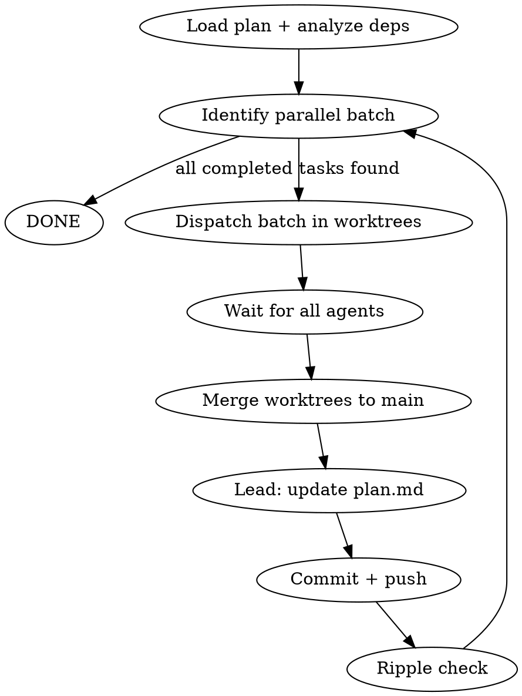

# Plan Execution

## Overview

Execute plan.md tasks with TDD discipline. Independent tasks run in parallel via git worktrees for isolation. Dependent tasks run sequentially. Each task is a unit of work: study first, write tests, implement, update the plan file with learnings, and checkmark completed items.

For example For maven project, you want to update your version so you do not clash with other worktrees.

## When to Use

- A `plan.md` exists with tasks in the checkbox format (see below), OR
- Task files exist in `ivy-docs/tasks/TASK-*.md` following the 10-section format (Prerequisites, Context, Specification, Implementation Details, Tests, Rules, Learning, Limitations, Field Notes, Acceptance Criteria). File naming provides ordering: `TASK-{PHASE}.{NUMBER}-{slug}.md` (e.g., `TASK-R.01-split-brain-prevention.md`).
- User says "execute the plan", "run plan.md", "start the tasks", "execute task X.YY"

### Task File Format (ivy-docs/tasks/)

When working from `ivy-docs/tasks/TASK-*.md` files:
- **Prerequisites** section defines dependencies (replaces `blockedBy` analysis)
- **Context + Specification** sections replace `Studying`
- **Acceptance Criteria** replaces `Objectives`
- **Learning, Limitations, Field Notes** sections are identical — update them in-place in the task file
- Ordering is by phase letter then number: Phase 0 → A → B → C → D → E → T → CG → L → MT → M1 → M2 → R → F

### plan.md Format (alternative)

Tasks in this format:
  ```
  ### Task N: title
  - [ ] **Studying:**
  - [ ] **Objectives:**
  - [ ] **Learning:**
  - [ ] **Limitations:**
  - [ ] **Field Notes:**
  ```

## Step 0 — Load ALL tasks and analyze dependencies

**Before doing any work**, read the entire plan.md and:

### 0a. Create Claude tasks
Create one Claude task (TaskCreate) per `### Task N:` entry.
- Subject: `Task N: <title>` (exact title from plan.md)
- Description: copy the full Studying + Objectives sections from plan.md
- ActiveForm: `Executing Task N: <title>`
- All tasks start as `pending`

### 0b. Analyze real dependencies
For each task, determine:
1. **Which modules it touches** (from the file paths in Studying/Objectives)
2. **Which tasks it depends on** (explicit references like "deferred from Task X", or shared modules/files)

Two tasks are **independent** when:
- They touch **different modules** (e.g., ivy-broker vs ivy-auth vs ivy-storage)
- OR they touch the same module but **different packages/classes** with no shared state
- AND neither references the other's output

Two tasks are **dependent** when:
- One explicitly references the other ("uses ModelDiff from Task 6")
- One creates files the other needs to study
- They modify the same files

### 0c. Set up dependency graph
Use `TaskUpdate` with `addBlockedBy` to set **real** dependencies (not just sequential). Independent tasks should NOT block each other.

### 0d. Present the execution plan to the user
Before starting, show:
- The dependency graph (which tasks are independent, which are chained)
- The planned parallel batches
- Ask for confirmation before proceeding

## Execution Flow — Parallel Batches via Worktrees



### How Parallel Batches Work

1. **Identify ready tasks** — tasks with no unresolved `blockedBy` dependencies
2. **Group into parallel batch** — all ready tasks that are independent (different modules)
3. **Dispatch each task to an Agent in its own worktree** — using `isolation: "worktree"` for full git isolation
4. **Wait for all agents** to complete (run agents in background, collect results)
5. **Merge worktrees** back to main, one at a time, verifying no conflicts
6. **Update plan.md** with all completed tasks' Learning/Limitations/Field Notes
7. **Commit + push** the merged result with a rich commit message
8. **Ripple check** — propagate learnings to future tasks
9. **Repeat** until all tasks done

### Worktree Safety Protocol

Each parallel agent runs in an **isolated git worktree** (`isolation: "worktree"`). This means:
- Each agent has its own copy of the repo
- Agents cannot interfere with each other
- Each agent commits on its own branch

**Merge-back procedure** (lead does this after all agents in a batch complete):
1. For each completed worktree branch, one at a time:
   a. `git merge --no-ff <worktree-branch>` into main
   b. If merge conflict → STOP, resolve manually or re-run the conflicting task
   c. Run `mvn test` on the affected module to verify merge didn't break anything
2. Only after ALL worktree branches are merged and tests pass → push
3. **Cleanup after each successful merge:**
   a. Remove the worktree: `git worktree remove <worktree-path>`
   b. Delete the worktree branch: `git branch -D <worktree-branch>`
   c. Verify cleanup: `git worktree list` should no longer show the worktree, `git branch` should no longer show the branch
   d. This is mandatory, not optional — stale worktrees and branches accumulate fast and cause confusion

**Cleanup on failure:** If a worktree agent fails and the task will be retried, still remove the worktree and branch before re-dispatching. The retry gets a fresh worktree with a new random suffix.

**When NOT to parallelize:**
- If two tasks touch the same module AND the same files → run sequentially
- If a task's Studying section references files created by another task in the same batch → run sequentially
- When in doubt → run sequentially. Safety over speed.

## Agent Dispatch

### Naming Convention

Every agent and worktree MUST be named after the task it executes, with a random 5-letter suffix for uniqueness.

Format: `task-<id>-<short-slug>-<5-random-lowercase-letters>`

Examples:
- Task 3 "PG Schema and Connection" → agent name: `task-3-pg-schema-xkwmf`, worktree name: `task-3-pg-schema-xkwmf`
- Task 12 "Claim Check Pattern" → agent name: `task-12-claim-check-brtyl`, worktree name: `task-12-claim-check-brtyl`
- Task SEC.23 "Container Hardening" → agent name: `task-sec23-container-hardening-qnzpv`, worktree name: `task-sec23-container-hardening-qnzpv`

Rules:
- The slug is 2-4 words from the task title, kebab-case, max 30 chars total before the suffix
- The 5-letter suffix is random lowercase a-z (generate fresh each time, no reuse)
- **CRITICAL: The agent `name` parameter and the worktree `name` parameter MUST be the exact same string.** This means `Agent(name: "task-3-pg-schema-xkwmf", isolation: "worktree")` creates a worktree at `.claude/worktrees/task-3-pg-schema-xkwmf/`. The user navigates worktree folders by agent name — if they don't match, it's unusable.
- This makes `git branch`, `git worktree list`, folder names, and agent logs all traceable to the same task

For each task, the lead spawns a **dedicated Agent** (subagent_type: `general-purpose`, mode: `auto`, `isolation: "worktree"` for parallel tasks, `name: "<task-slug-suffix>"`) with a prompt containing:

1. **The full task description** from plan.md (Studying, Objectives, all details)
2. **Relevant context** — file paths, previous task learnings/limitations that affect this task
3. **Clear instructions**: study first, TDD, run tests, commit on success
4. **The commit message format** — rich format with Intent, What was done, Learning, Limitations, Field Notes

The agent has its own fresh context and its own worktree — fully isolated.

### What the Lead Does

The lead orchestrator is responsible for:
- Loading the plan, analyzing dependencies, creating Claude tasks (Step 0)
- Identifying parallel batches of independent tasks
- Dispatching agents (in worktrees for parallel, direct for sequential)
- Merging worktree branches back to main safely
- Processing agents' results (success, failure, learnings)
- Updating plan.md in-place (checkmarks, Learning, Limitations, Field Notes)
- Committing with rich commit message and pushing
- Running the ripple check (propagating impact to future tasks)

### What the Agent Does

The agent receives a self-contained prompt and executes autonomously:
- Study the listed files
- Write tests (RED), implement (GREEN), run tests
- Fix failures until tests pass
- Commit (on worktree branch if parallel, on main if sequential)
- Return a summary: what was done, what was learned, any limitations discovered

## Rules

1. **Load the full plan first.** Create ALL Claude tasks from plan.md before starting any work.
2. **Analyze dependencies.** Set up real dependency graph, not blind sequential chain.
3. **Parallelize independent tasks.** Tasks on different modules with no shared files run in parallel via worktrees.
4. **Mark in_progress.** Use `TaskUpdate` before spawning the agent.
5. **Agent does the work.** The lead never writes code or runs tests directly — that is the agent's job.
6. **Self-contained prompt.** The agent prompt must include everything needed — the agent has no access to the lead's context.
7. **TDD.** The agent prompt must enforce: write tests before implementation, tests must fail first (RED), then pass (GREEN).
8. **Lead updates plan.md** after agents return — checkmarks, Learning, Limitations, Field Notes for ALL tasks in the batch.
9. **Commit + push** with plan.md included and a **rich commit message**. For parallel batches, one commit per task after merge-back. Format:
   ```
   feat: task N — <title>

   ## Intent
   - <what this task achieves and why, in 1-2 sentences>

   ## What was done
   - <files created/modified, classes added, what they do>
   - <number of tests added, total test count>

   ## Learning
   - <bullet points from plan.md Learning section>

   ## Limitations
   - <bullet points from plan.md Limitations section>

   ## Field Notes
   - <bullet points from plan.md Field Notes section>
   ```
10. **Mark completed.** Use `TaskUpdate` after the commit.
11. **Build one module at a time.** Never `mvn` on the parent with multiple modules.
12. **Verify via agent.** The agent must run tests and confirm they pass before returning. If the agent reports failure, do not mark the task as completed.
13. **Verify after merge.** After merging a worktree branch, run tests on the affected module before proceeding to the next merge.

## Plan.md Checkmark Protocol

Each line under a task section is independently checkable:

```markdown
- [x] **Studying:**
    - [x] file X
    - [x] file Y

- [x] **Objectives:**
    - [x] objective 1
    - [x] objective 2

- [x] **Learning:**
    - ThreeWayMerge needs base content, not hash.
    - Manifest must store original content or use git.
- [x] **Limitations:**
    - Cannot retrieve base content without git history or stored copy.
- [x] **Field Notes:**
    - StagingEngine bug confirmed on line 29. Fixed by storing base content in manifest.
- [x] **Added Tasks:**
    - Modified Task 8: Added ManifestWriter.java to Studying — new writeBaseContent() method created here
```

## Task Ripple — Propagate Impact to Future Tasks

A completed task may change the landscape for tasks that come after it. After completing a task, **always check if learnings, limitations, or decisions impact future tasks**.

### The Iron Rule of Deferred Work

**Every "deferred to Task X" in Limitations MUST immediately become an objective in Task X.**

Writing "deferred to Task 28" in your Limitations without updating Task 28's Objectives is losing work. The limitation is a note about what YOU didn't do. The objective in the target task is the guarantee that it WILL be done. Both must exist.

Concretely, after writing a Limitation like:
> `.gitattributes` not yet generated — deferred to Task 28 (File visibility)

You MUST immediately:
1. Open Task 28 in plan.md → add `- [ ] Generate .gitattributes with linguist-generated=true for generated file paths (deferred from Task 2)` to its **Objectives:**
2. `TaskUpdate` Claude task for Task 28 with the updated description

### When to Propagate

When a task's outcome affects other tasks:

1. **Update plan.md** — edit the affected task's Studying/Objectives sections to reflect the new reality (new files to study, changed objectives, removed objectives, new prerequisites)
2. **Update Claude tasks** — use `TaskUpdate` to sync the description of each affected Claude task with the updated plan.md content
3. **Add or remove tasks** — if a new task is needed or an existing one is obsolete, update plan.md and Claude tasks accordingly
4. **Log the ripple** — in the completed task's plan.md entry, add an **Added Tasks:** section documenting what changed and why:

```markdown
- [x] **Added Tasks:**
    - Added Task 45: Implement retry logic — discovered during Task 12 that the API has transient failures
    - Modified Task 15: Added new file to Studying — StagingEngine.java was created in this task
    - Added objective to Task 28: "Generate .gitattributes" — deferred from this task
```

Examples of ripple triggers:
- **Deferred work** — a Limitation says "deferred to Task X" → add objective to Task X
- A new class was created that future tasks need to study
- An objective was partially achieved ahead of schedule — remove it from the future task
- A limitation discovered means a future task needs an extra objective
- A design decision constrains how a future task should be approached
- An objective turns out to be impossible or unnecessary — remove or replace it
- A new need is discovered that doesn't fit any existing task — create a new task

**Do not defer ripple updates.** Do them immediately after completing the task, before the commit. Future tasks must always reflect current reality.

## Red Flags — STOP

- Starting work before ALL tasks are loaded into Claude tasks
- **The lead writing code or running tests directly** — that is the agent's job
- Spawning an agent with an incomplete prompt (missing files, objectives, or context from previous tasks)
- **Parallelizing tasks that touch the same files** — this causes merge conflicts
- Merging a worktree branch without running tests on the affected module
- Writing implementation before tests (agent must enforce TDD)
- Skipping the Studying phase
- Marking a task done with failing tests
- Forgetting to update Learning/Limitations/Field Notes (these are NOT optional)
- Completing a task that impacts future tasks without propagating changes to plan.md and Claude tasks
- Writing "deferred to Task X" in Limitations without adding the objective to Task X


# Important

When you write new files, you add a comment at the top like

// Time: Created - name of the task, or name of the task file

When you update a file, you add a comment of the change at the top

// Time: Update - name of the task, or name of the task file + reason


# ! Important !!

You always need to add in the task file what you learned, what you did, and what are the limitations of your implementation. This is important for the next person who will work on the next task, so they can understand the context and the decisions that were made.

## File Manifest — Bidirectional Traceability

After every commit for a task, maintain a `## File Manifest` section at the bottom of the TASK-*.md file.

### After each commit

Run `git diff --name-status HEAD~1 HEAD -- '*.java' '*.xml' '*.json' '*.yaml' '*.yml'` and append:

```markdown
## File Manifest

### YYYY-MM-DD — <short description> (commit <hash>)
Modified:
  - path/to/Existing.java — <what changed: e.g., "added new method, updated logic in existing method">
```

### Cross-task impact detection

When a task modifies a file that was **created by a different task** (check the `// Created - TASK-X.XX` header comment), assess whether the change is **structural**:

**Structural = notify the origin task:**
- Changes the public API (new/removed/renamed methods, changed signatures)
- Changes the validation rules or constructor contract
- Changes the class hierarchy or interface implementation
- Removes or replaces a pattern the origin task established

**Non-structural = silent, no notification:**
- Adding imports
- Adding annotations that don't change behavior (`@NullMarked`, `@Override`)
- Formatting, comments
- Adding new methods without changing existing ones
- Internal implementation changes that preserve the public contract

### When structural: update the origin task

Append to the **origin task's** `## File Manifest`:

```markdown
### YYYY-MM-DD — Structurally modified by TASK-X.XX (commit <hash>)
Reason: <what changed and why it matters to this task's design>
Files impacted:
  - path/to/File.java — <specific change: e.g., "compact constructor removed, @NullMarked adopted">
```

This way each task file is a complete audit trail: what it created, and what happened to those files later — but only when it matters.
